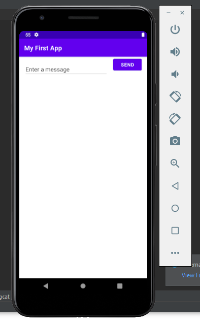

# IETI-lab11

## Pruebas de lo trabajo en la intrudccion de [Android Studio](https://developer.android.com/training/basics/firstapp/)

1. Prueba de la aplicación corriendo.

2. Prueba de configuración de boton y caja de texto.

3. Prueba de enviar un mensaje a otra vista.

